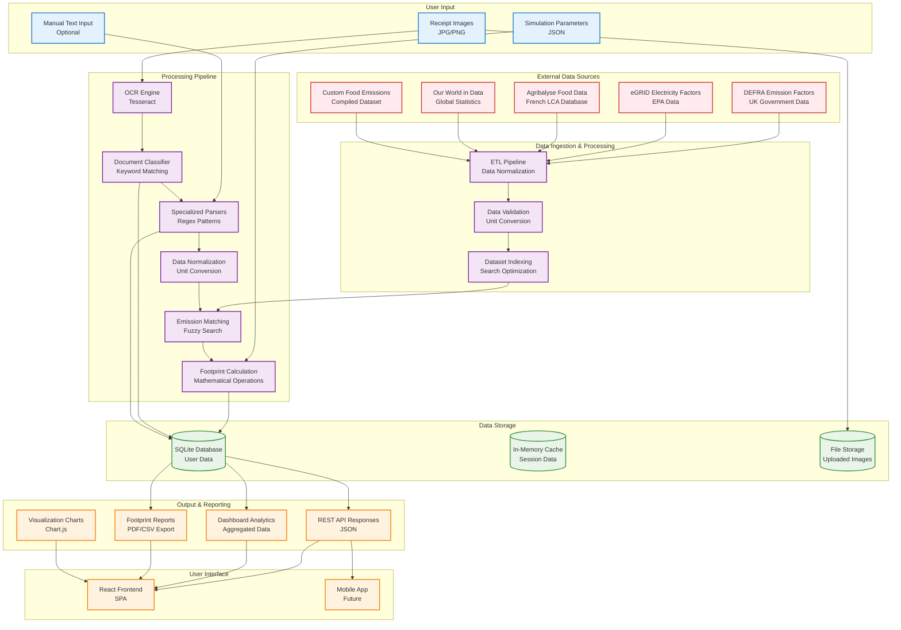
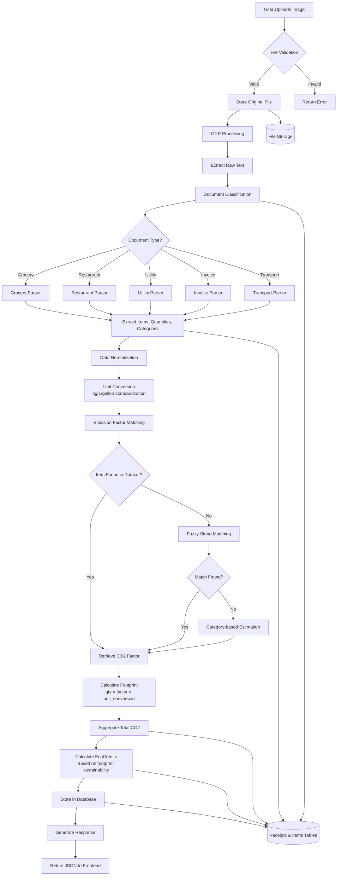
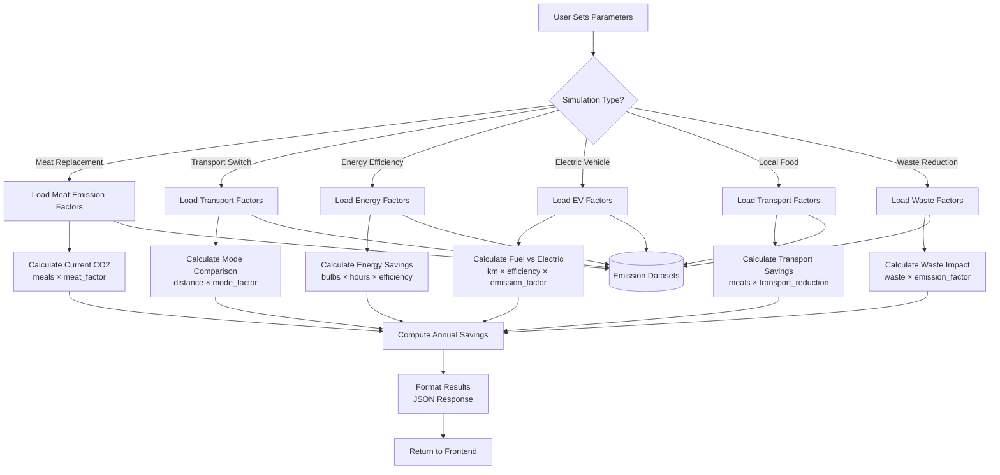
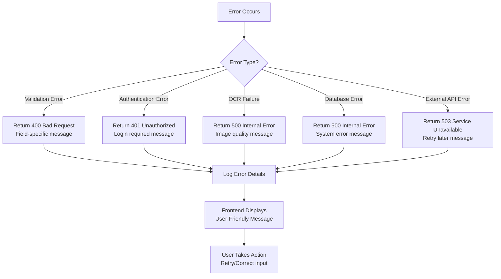
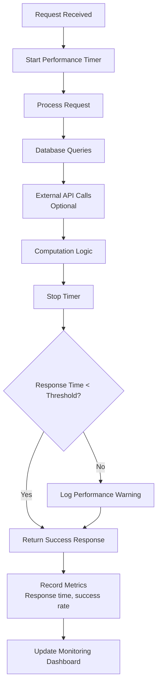
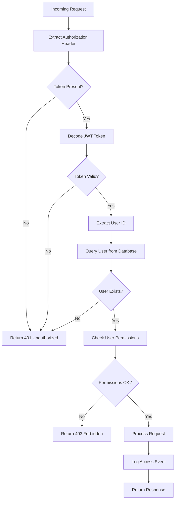

# CarbonDrop Data Flow Diagram

## Overview

This document illustrates how data flows through the CarbonDrop system from user input to final carbon footprint calculations and reporting.

## High-Level Data Flow Diagram



## Detailed Data Flow: Receipt Processing



## Data Flow: What-If Simulations



## Data Flow: Dashboard Analytics

```mermaid
flowchart TD
    A[User Loads Dashboard] --> B[Authenticate User]
    B --> C[Query User Receipts]

    C --> D[Aggregate by Month<br/>SQL GROUP BY]
    D --> E[Calculate Trends<br/>Month-over-month change]

    C --> F[Query User Offsets<br/>Tree planting history]
    F --> G[Calculate Total Trees<br/>CO2 offset]

    C --> H[Query EcoCredits<br/>Current balance]
    H --> I[Calculate Badge Level<br/>Based on trees planted]

    E --> J[Format Chart Data<br/>{month, total} arrays]
    G --> K[Format Offset Data<br/>trees, offset_kg, badge]
    I --> L[Format Credit Data<br/>balance, level]

    J --> M[Combine Dashboard Data]
    K --> M
    L --> M

    M --> N[Return JSON Response]
    N --> O[Render Charts<br/>Chart.js visualization]
```

## Data Dictionary

### Input Data Types

| Data Type         | Source      | Format    | Validation                            |
| ----------------- | ----------- | --------- | ------------------------------------- |
| Receipt Images    | User Upload | JPG/PNG   | File size < 10MB, dimensions < 5000px |
| Simulation Params | User Form   | JSON      | Required fields, numeric ranges       |
| Authentication    | User Login  | JWT Token | Valid signature, not expired          |
| Manual Text       | User Input  | String    | Length < 1000 chars, no special chars |

### Processed Data Types

| Data Type             | Processing       | Output Format      | Storage                  |
| --------------------- | ---------------- | ------------------ | ------------------------ |
| OCR Text              | Tesseract        | String             | Temporary (not stored)   |
| Document Type         | Keyword Matching | Enum               | receipts.document_type   |
| Parsed Items          | Regex Patterns   | Array of Objects   | items table              |
| Normalized Quantities | Unit Conversion  | Float (kg/L/units) | items.qty, items.unit    |
| Matched Emissions     | Fuzzy Search     | Float (kgCO2e)     | items.footprint          |
| Total Footprint       | Summation        | Float (kgCO2e)     | receipts.total_footprint |
| EcoCredits            | Algorithm        | Integer            | users.eco_credits        |

### Output Data Types

| Data Type          | Consumer      | Format     | Update Frequency  |
| ------------------ | ------------- | ---------- | ----------------- |
| Receipt Analysis   | Frontend      | JSON       | Real-time         |
| Dashboard Data     | Frontend      | JSON Array | On page load      |
| Simulation Results | Frontend      | JSON       | On simulation run |
| Leaderboard        | Frontend      | JSON Array | Daily cache       |
| Export Data        | User Download | CSV/PDF    | On demand         |

## Data Storage Schema

### SQLite Tables

```sql
-- Users table
CREATE TABLE users (
    id INTEGER PRIMARY KEY,
    username VARCHAR UNIQUE,
    password_hash VARCHAR,
    eco_credits INTEGER DEFAULT 0
);

-- Receipts table
CREATE TABLE receipts (
    id INTEGER PRIMARY KEY,
    user_id INTEGER REFERENCES users(id),
    total_footprint FLOAT,
    document_type VARCHAR,
    date DATETIME DEFAULT CURRENT_TIMESTAMP
);

-- Items table
CREATE TABLE items (
    id INTEGER PRIMARY KEY,
    receipt_id INTEGER REFERENCES receipts(id),
    name VARCHAR,
    matched_name VARCHAR,
    qty FLOAT,
    unit VARCHAR,
    footprint FLOAT,
    category VARCHAR DEFAULT 'food'
);

-- User offsets (tree planting)
CREATE TABLE user_offsets (
    id INTEGER PRIMARY KEY,
    user_id INTEGER REFERENCES users(id),
    trees_planted INTEGER,
    co2_offset_kg FLOAT,
    date DATETIME DEFAULT CURRENT_TIMESTAMP
);
```

## Data Validation Rules

### Input Validation

- **File Upload**: MIME type check, size limits, image corruption detection
- **Text Input**: Length limits, XSS prevention, special character filtering
- **Numeric Parameters**: Range validation, type checking, null prevention

### Business Logic Validation

- **Quantities**: Must be positive, reasonable ranges (0.001 - 10000 kg)
- **Emission Factors**: Must exist in dataset, not null/zero
- **User Permissions**: JWT validation, user existence check
- **Credit Balance**: Sufficient funds for tree planting

## Error Handling Data Flow



## Performance Data Flow



## Security Data Flow



## Data Retention Policy

- **User Data**: Retained indefinitely unless user requests deletion
- **Receipt Images**: Stored for 1 year, then archived
- **Processing Logs**: Retained for 90 days
- **Analytics Data**: Aggregated and retained indefinitely
- **Temporary Files**: Deleted immediately after processing

## Backup and Recovery

- **Database**: Daily automated backups
- **File Storage**: Weekly backups of uploaded images
- **Configuration**: Version controlled, backed up with code
- **Recovery Time**: < 4 hours for database, < 24 hours for files

## Data Privacy Compliance

- **User Data**: Encrypted at rest, anonymized in analytics
- **Image Data**: Processed server-side, not stored with PII
- **Export Controls**: Users can request data deletion
- **Third-party Data**: Sourced from public government datasets
