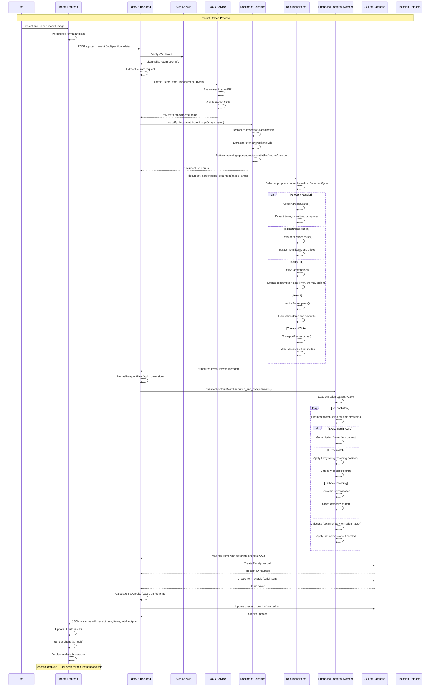
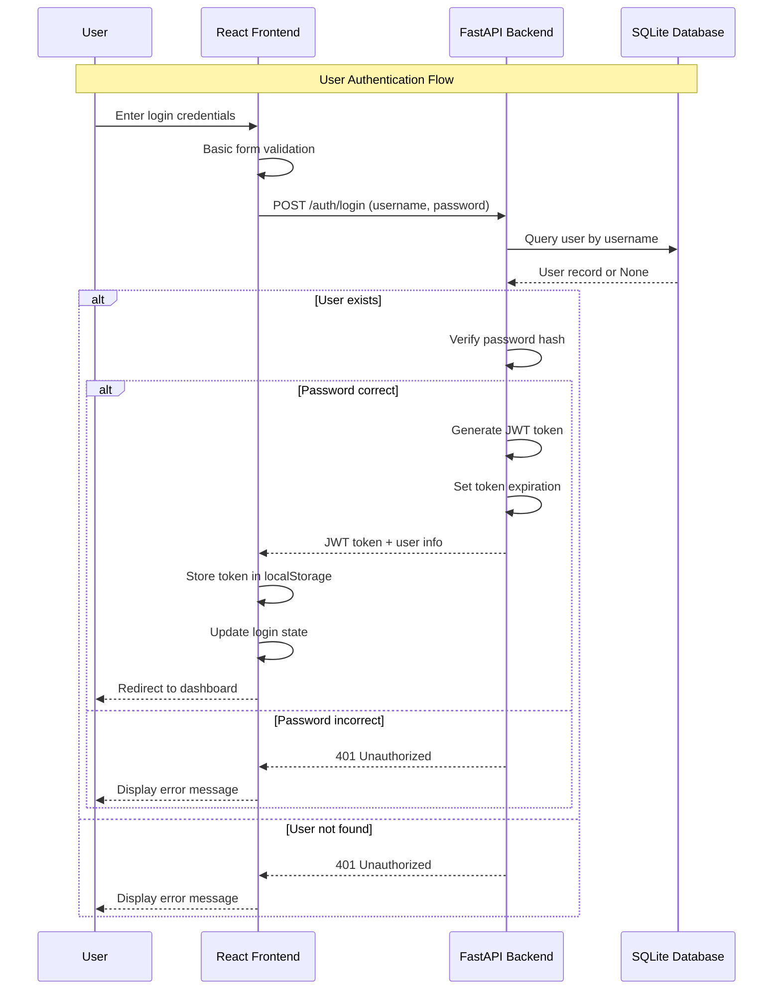
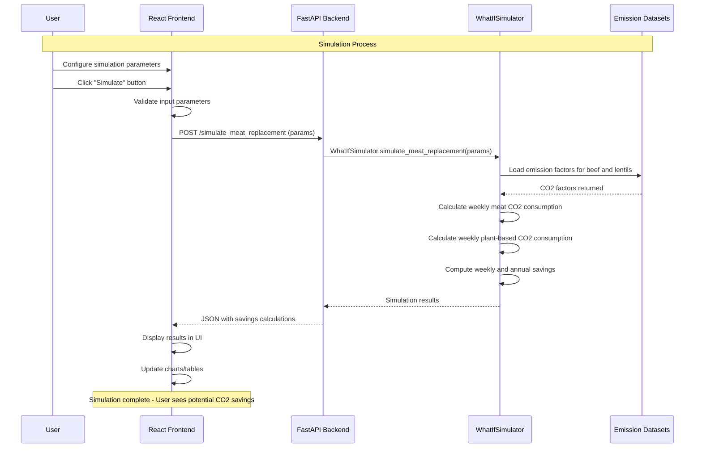
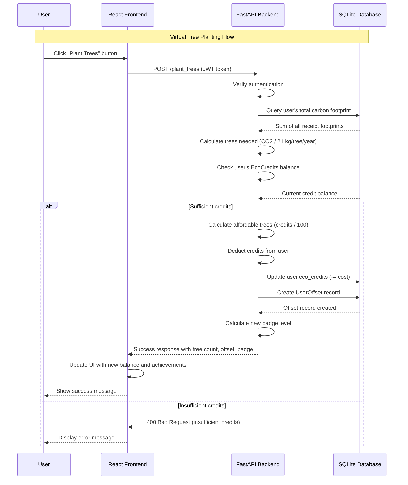
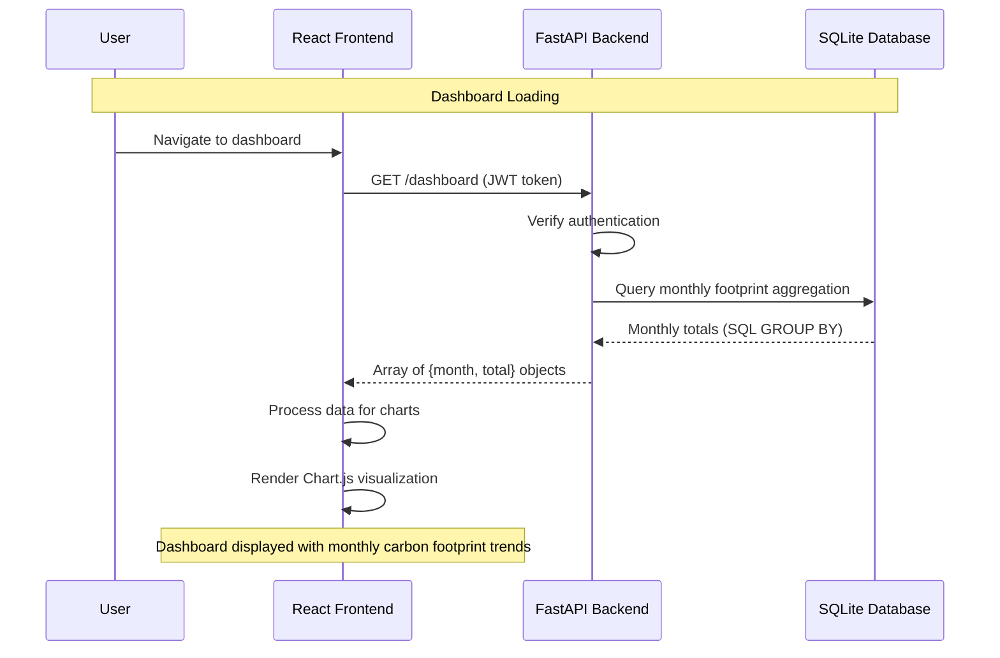
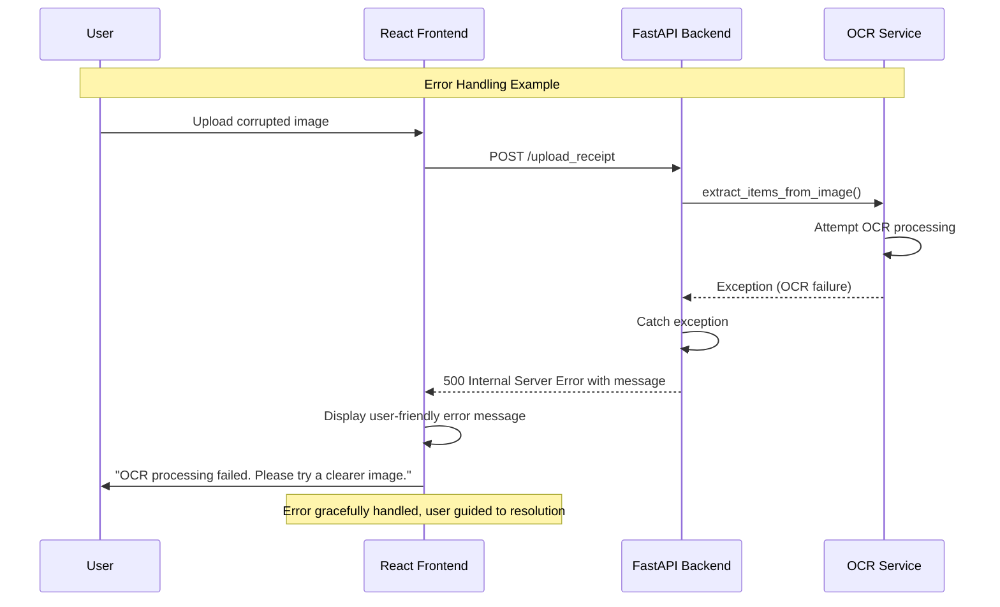
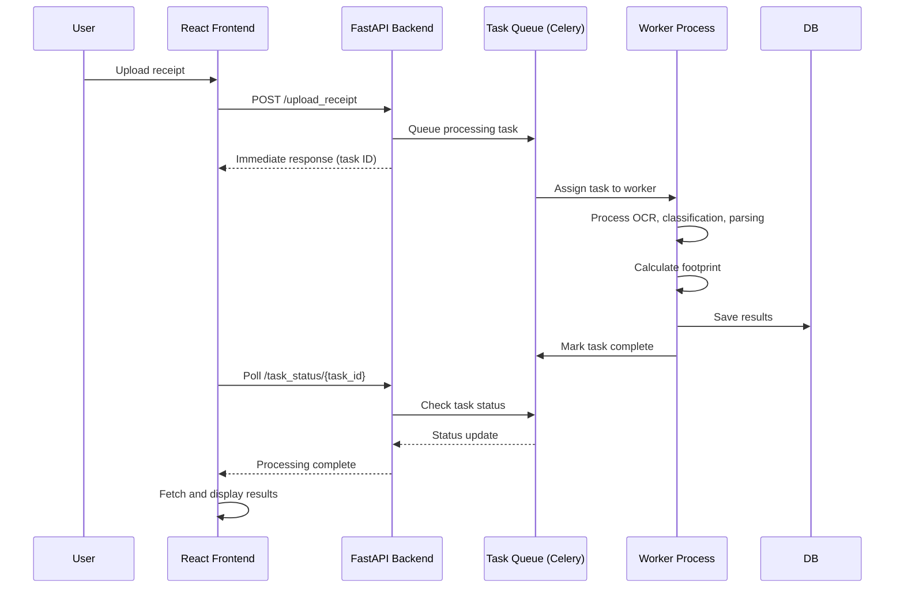
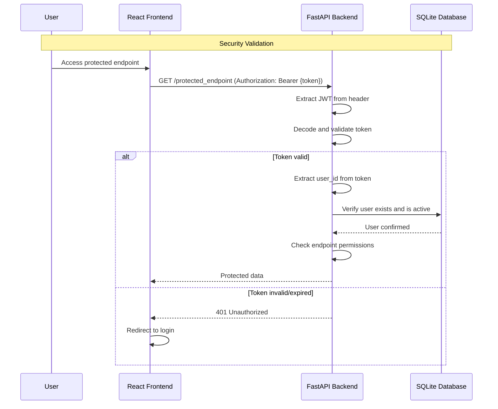
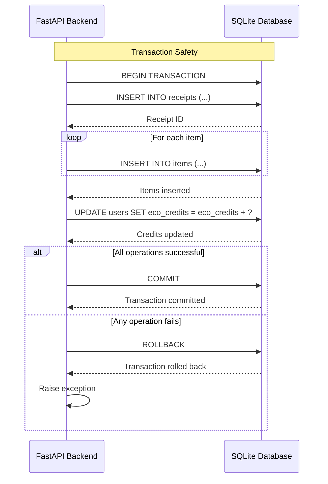

# CarbonDrop Sequence Diagram

## Overview

This document illustrates the detailed sequence of interactions during the receipt upload and carbon footprint calculation process in CarbonDrop.

## Receipt Upload Sequence Diagram



## Authentication Sequence Diagram



## What-If Simulation Sequence Diagram



## Tree Planting Sequence Diagram



## Dashboard Data Retrieval Sequence Diagram



## Error Handling Sequence



## Performance Considerations

### Synchronous Processing

- Current implementation processes uploads synchronously
- OCR and classification happen sequentially
- Total processing time: 5-15 seconds for typical receipt

### Future Asynchronous Processing



## Security Sequence



## Database Transaction Sequence



## API Response Format

### Successful Upload Response

```json
{
  "id": 123,
  "user_id": 456,
  "total_footprint": 15.67,
  "document_type": "grocery",
  "items": [
    {
      "name": "Organic Milk 2L",
      "matched_name": "milk",
      "qty": 2.0,
      "unit": "kg",
      "footprint": 2.34,
      "category": "food"
    }
  ],
  "date": "2024-01-15T10:30:00Z"
}
```

### Error Response

```json
{
  "detail": "OCR failed: Unable to extract text from image. Please ensure the image is clear and well-lit."
}
```

## Performance Metrics

- **OCR Processing**: 2-5 seconds
- **Document Classification**: < 1 second
- **Parsing**: 1-3 seconds
- **Footprint Matching**: < 1 second
- **Database Operations**: < 0.5 seconds
- **Total Response Time**: 5-15 seconds

## Monitoring Points

- JWT token validation success/failure
- OCR success rate by image quality
- Document classification accuracy
- Database query performance
- API response times by endpoint
- Error rates and types
