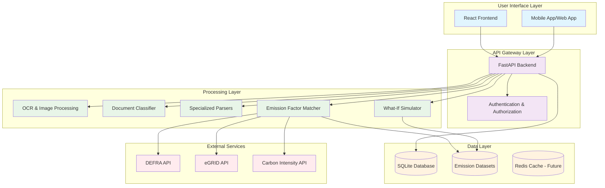

# CarbonDrop System Architecture

## Overview

CarbonDrop is a comprehensive multi-domain carbon footprint calculator that processes various types of documents (receipts, invoices, utility bills, transport tickets) to calculate environmental impact. The system uses advanced OCR, document classification, specialized parsers, and emission factor matching to provide accurate carbon footprint analysis.

## High-Level Architecture

## Component Descriptions

### User Interface Layer

- **React Frontend**: Single-page application with routing for upload, history, dashboard, simulator, and authentication
- **Components**: Upload, History, Dashboard, Leaderboard, Simulator, Login/Register, Navbar, Footer
- **Features**: File upload, chart visualization, form inputs, responsive design

### API Gateway Layer

- **FastAPI Backend**: RESTful API with automatic OpenAPI documentation
- **Endpoints**:
  - `/upload_receipt`: Document processing and footprint calculation
  - `/auth/*`: User authentication and management
  - `/simulate_*`: What-if scenario calculations
  - `/dashboard`: Monthly footprint aggregation
  - `/leaderboard`: User ranking system
  - `/plant_trees`: Virtual tree planting for carbon offset

### Processing Layer

#### OCR & Image Processing

- **Technology**: Tesseract OCR with PIL preprocessing
- **Function**: Extract text from uploaded images (receipts, bills, tickets)
- **Preprocessing**: Image enhancement, noise reduction, text region detection

#### Document Classifier

- **Algorithm**: Keyword-based classification with pattern matching
- **Document Types**:
  - Grocery receipts
  - Restaurant receipts
  - Utility bills
  - Invoices
  - Transport tickets
- **Features**: Automatic document type detection, fallback to grocery default

#### Specialized Parsers

- **GroceryParser**: Extracts items, quantities, prices from supermarket receipts
- **RestaurantParser**: Recognizes menu items and dining expenses
- **UtilityParser**: Processes electricity, gas, water consumption data
- **InvoiceParser**: Handles general business invoices
- **TransportParser**: Extracts travel distances, fuel consumption, ticket info

#### Emission Factor Matcher

- **EnhancedFootprintMatcher**: Multi-domain matching with fuzzy string matching
- **Features**:
  - Category-aware matching (food, transport, energy, utility)
  - Fallback strategies and semantic normalization
  - Confidence scoring and multiple matching algorithms
- **Datasets**: Integrated DEFRA factors, Agribalyse, eGRID, custom food emissions

#### What-If Simulator

- **Scenarios**:
  - Meat replacement with plant-based alternatives
  - Transport mode switching (flight→train, car→EV)
  - Energy efficiency improvements (incandescent→LED)
  - Electric vehicle adoption
  - Local food consumption
  - Waste reduction
- **Calculations**: Annual CO2 savings, energy consumption, cost analysis

### Data Layer

- **SQLite Database**: Relational storage with SQLAlchemy ORM
- **Tables**:
  - `users`: User accounts and EcoCredits
  - `receipts`: Uploaded documents with metadata
  - `items`: Parsed line items with footprint calculations
  - `user_offsets`: Virtual tree planting records
- **Datasets**: CSV files with emission factors for different categories

### External Services Integration

- **DEFRA API**: UK government greenhouse gas conversion factors
- **eGRID**: US electricity grid emission factors
- **Carbon Intensity API**: Real-time UK grid carbon intensity
- **Future**: ICAO aviation emissions, commercial LCA databases

## Technology Stack

### Backend

- **Framework**: FastAPI (Python)
- **Database**: SQLite with SQLAlchemy ORM
- **OCR**: Tesseract with pytesseract
- **Image Processing**: PIL (Pillow)
- **Text Matching**: RapidFuzz
- **Data Processing**: Pandas
- **Authentication**: JWT tokens

### Frontend

- **Framework**: React with Vite
- **Routing**: React Router
- **Styling**: Tailwind CSS
- **Charts**: Chart.js
- **HTTP Client**: Fetch API

### Infrastructure

- **Deployment**: Local development with uvicorn
- **Environment**: Python virtual environment
- **Package Management**: pip (backend), npm (frontend)

## Data Flow

1. **Document Upload**: User uploads image via React frontend
2. **Authentication**: JWT token validation
3. **OCR Processing**: Image text extraction
4. **Classification**: Document type identification
5. **Parsing**: Specialized parser extracts structured data
6. **Matching**: Emission factors matched to items
7. **Calculation**: Carbon footprint computation
8. **Storage**: Results saved to database
9. **Response**: JSON data returned to frontend
10. **Visualization**: Charts and tables displayed to user

## Security Considerations

- JWT-based authentication for API access
- File upload validation and size limits
- CORS configuration for frontend-backend communication
- Input sanitization and validation
- Secure storage of user credentials (hashed passwords)

## Scalability Considerations

- **Current**: Single-threaded processing, SQLite database
- **Future Enhancements**:
  - Asynchronous processing with Celery
  - PostgreSQL with pgvector for embeddings
  - Redis caching layer
  - Load balancing for multiple instances
  - Cloud storage for uploaded files

## Monitoring and Logging

- **Logging**: Python logging with structured output
- **Error Handling**: Comprehensive exception handling with user-friendly messages
- **Performance**: Response time monitoring for API endpoints
- **Usage Analytics**: User interaction tracking for improvement insights
