# CarbonDrop Use Case Diagram

## Overview

This document describes the primary use cases of the CarbonDrop system, showing the interactions between users and the system to achieve carbon footprint tracking and reduction goals.

## Use Case Diagram

```mermaid
flowchart TD
    subgraph "Actors"
        U[👤 User<br/>Carbon Conscious Individual]
        S[🤖 System<br/>CarbonDrop Application]
    end

    subgraph "Authentication & Account Management"
        UC1[Register Account]
        UC2[Login to System]
        UC3[Logout from System]
        UC4[View Profile]
        UC5[Update Profile]
    end

    subgraph "Document Processing"
        UC6[Upload Receipt/Bill]
        UC7[Automatic Document Classification]
        UC8[OCR Text Extraction]
        UC9[Parse Document Items]
        UC10[Calculate Carbon Footprint]
        UC11[View Analysis Results]
    end

    subgraph "Footprint Tracking & History"
        UC12[View Footprint History]
        UC13[View Monthly Dashboard]
        UC14[Compare with Peers]
        UC15[View Leaderboard]
        UC16[Export Footprint Data]
    end

    subgraph "What-If Simulations"
        UC17[Simulate Meat Replacement]
        UC18[Simulate Transport Switch]
        UC19[Simulate Energy Efficiency]
        UC20[Simulate Electric Vehicle]
        UC21[Simulate Local Food Choice]
        UC22[Simulate Waste Reduction]
        UC23[View Simulation Results]
    end

    subgraph "Gamification & Offsetting"
        UC24[Earn EcoCredits]
        UC25[View Credit Balance]
        UC26[Plant Virtual Trees]
        UC27[View Tree Planting History]
        UC28[View Achievement Badges]
    end

    subgraph "System Administration"
        UC29[Manage Emission Datasets]
        UC30[Monitor System Performance]
        UC31[View User Analytics]
        UC32[Update System Configuration]
    end

    %% Actor connections
    U --> UC1
    U --> UC2
    U --> UC3
    U --> UC4
    U --> UC5
    U --> UC6
    U --> UC12
    U --> UC13
    U --> UC14
    U --> UC15
    U --> UC16
    U --> UC17
    U --> UC18
    U --> UC19
    U --> UC20
    U --> UC21
    U --> UC22
    U --> UC23
    U --> UC24
    U --> UC25
    U --> UC26
    U --> UC27
    U --> UC28

    S --> UC7
    S --> UC8
    S --> UC9
    S --> UC10
    S --> UC11
    S --> UC29
    S --> UC30
    S --> UC31
    S --> UC32

    %% Use case relationships
    UC6 --> UC7
    UC7 --> UC8
    UC8 --> UC9
    UC9 --> UC10
    UC10 --> UC11

    UC17 --> UC23
    UC18 --> UC23
    UC19 --> UC23
    UC20 --> UC23
    UC21 --> UC23
    UC22 --> UC23

    UC10 --> UC24
    UC24 --> UC25
    UC25 --> UC26
    UC26 --> UC27
    UC26 --> UC28

    %% Styling
    classDef actorClass fill:#e3f2fd,stroke:#1976d2,stroke-width:2px
    classDef primaryClass fill:#f3e5f5,stroke:#7b1fa2,stroke-width:2px
    classDef secondaryClass fill:#e8f5e8,stroke:#388e3c,stroke-width:2px
    classDef tertiaryClass fill:#fff3e0,stroke:#f57c00,stroke-width:2px
    classDef adminClass fill:#ffebee,stroke:#d32f2f,stroke-width:2px

    class U,S actorClass
    class UC1,UC2,UC3,UC4,UC5 primaryClass
    class UC6,UC7,UC8,UC9,UC10,UC11 secondaryClass
    class UC12,UC13,UC14,UC15,UC16 tertiaryClass
    class UC17,UC18,UC19,UC20,UC21,UC22,UC23 tertiaryClass
    class UC24,UC25,UC26,UC27,UC28 tertiaryClass
    class UC29,UC30,UC31,UC32 adminClass
```

## Detailed Use Case Descriptions

### Primary Actor: User (Carbon Conscious Individual)

#### Authentication & Account Management

1. **Register Account**

   - **Description**: Create a new user account with email/username and password
   - **Preconditions**: None
   - **Postconditions**: User account created, initial EcoCredits awarded
   - **Alternative Flows**: Email verification required

2. **Login to System**

   - **Description**: Authenticate using credentials to access personal features
   - **Preconditions**: Valid user account exists
   - **Postconditions**: JWT token issued, user session established

3. **Logout from System**
   - **Description**: End user session and clear authentication
   - **Preconditions**: User is logged in
   - **Postconditions**: Session terminated, token invalidated

#### Document Processing

4. **Upload Receipt/Bill**

   - **Description**: Upload image of receipt, invoice, utility bill, or transport ticket
   - **Preconditions**: User logged in, valid image file
   - **Postconditions**: Document processed, carbon footprint calculated, EcoCredits awarded
   - **Alternative Flows**: Invalid file format, OCR failure, unsupported document type

5. **View Analysis Results**
   - **Description**: Review detailed breakdown of carbon footprint by item/category
   - **Preconditions**: Successful document upload and processing
   - **Postconditions**: Visual charts and tables displayed

#### Footprint Tracking & History

6. **View Footprint History**

   - **Description**: Browse previously uploaded documents and their carbon footprints
   - **Preconditions**: User has uploaded at least one document
   - **Postconditions**: Chronological list with filtering options

7. **View Monthly Dashboard**

   - **Description**: See aggregated carbon footprint data by month
   - **Preconditions**: Multiple uploads across different months
   - **Postconditions**: Charts showing trends and comparisons

8. **Compare with Peers**
   - **Description**: View leaderboard showing user ranking against other users
   - **Preconditions**: Multiple active users in system
   - **Postconditions**: Relative performance metrics displayed

#### What-If Simulations

9. **Simulate Meat Replacement**

   - **Description**: Calculate CO2 savings from replacing meat meals with plant-based alternatives
   - **Preconditions**: None
   - **Postconditions**: Annual savings estimate provided

10. **Simulate Transport Switch**

    - **Description**: Compare carbon footprint of different transport modes
    - **Preconditions**: Trip details provided
    - **Postconditions**: Savings calculation for mode switching

11. **Simulate Energy Efficiency**

    - **Description**: Calculate savings from LED bulb replacement
    - **Preconditions**: Current bulb count and usage provided
    - **Postconditions**: Energy and CO2 savings estimates

12. **Simulate Electric Vehicle**

    - **Description**: Compare gasoline vs electric vehicle emissions
    - **Preconditions**: Annual mileage and efficiency data
    - **Postconditions**: Annual CO2 savings calculation

13. **Simulate Local Food Choice**

    - **Description**: Calculate impact of choosing local vs imported food
    - **Preconditions**: Weekly meal consumption data
    - **Postconditions**: Transport-related CO2 savings

14. **Simulate Waste Reduction**
    - **Description**: Estimate CO2 savings from reducing food waste
    - **Preconditions**: Current waste levels provided
    - **Postconditions**: Annual waste reduction and CO2 savings

#### Gamification & Offsetting

15. **Earn EcoCredits**

    - **Description**: Automatically receive credits based on sustainable choices
    - **Preconditions**: Document upload with calculated footprint
    - **Postconditions**: Credit balance updated

16. **Plant Virtual Trees**

    - **Description**: Redeem EcoCredits to plant virtual trees for carbon offset
    - **Preconditions**: Sufficient credit balance, carbon footprint data available
    - **Postconditions**: Trees planted, offset recorded, badge potentially upgraded

17. **View Achievement Badges**
    - **Description**: See gamification achievements based on tree planting milestones
    - **Preconditions**: Trees planted
    - **Postconditions**: Current badge and level displayed

### Secondary Actor: System (CarbonDrop Application)

#### System Administration

18. **Manage Emission Datasets**

    - **Description**: Update and maintain emission factor databases
    - **Preconditions**: Administrative access
    - **Postconditions**: Updated factors available for calculations

19. **Monitor System Performance**

    - **Description**: Track API response times, error rates, and system health
    - **Preconditions**: Monitoring tools configured
    - **Postconditions**: Performance metrics available

20. **View User Analytics**

    - **Description**: Analyze user behavior and system usage patterns
    - **Preconditions**: User data available
    - **Postconditions**: Analytics dashboard populated

21. **Update System Configuration**
    - **Description**: Modify system settings, thresholds, and parameters
    - **Preconditions**: Administrative privileges
    - **Postconditions**: Configuration changes applied

## Use Case Relationships

### Include Relationships

- **Upload Receipt** includes **Automatic Document Classification**, **OCR Text Extraction**, **Parse Document Items**, **Calculate Carbon Footprint**
- **Calculate Carbon Footprint** includes **Earn EcoCredits**
- **Plant Virtual Trees** includes **View Achievement Badges**

### Extend Relationships

- **View Analysis Results** extends **Upload Receipt** (when processing succeeds)
- **View Simulation Results** extends all simulation use cases
- **Export Footprint Data** extends **View Footprint History**

## Non-Functional Requirements Addressed

### Performance

- Document processing should complete within 30 seconds
- Dashboard queries should respond within 2 seconds
- Simulations should calculate results within 1 second

### Security

- All user data must be encrypted in transit and at rest
- Authentication required for personal data access
- File uploads must be validated for malicious content

### Usability

- Intuitive interface for document upload and result viewing
- Clear visualization of carbon footprint data
- Responsive design for mobile and desktop access

### Reliability

- System should maintain 99% uptime
- Failed uploads should not corrupt user data
- Automatic retry mechanisms for external API calls

## Future Use Cases

### Mobile Application

- **Scan Receipt with Camera**: Direct camera integration for receipt capture
- **Offline Mode**: Queue uploads for later synchronization
- **Push Notifications**: Alerts for high-footprint items or achievement unlocks

### Advanced Analytics

- **Trend Analysis**: Long-term carbon footprint trends with predictions
- **Peer Comparison**: Detailed comparison with similar user profiles
- **Carbon Budgeting**: Set personal carbon goals and track progress

### Social Features

- **Share Achievements**: Post badges and milestones to social media
- **Group Challenges**: Team-based carbon reduction competitions
- **Community Forums**: Discussion boards for sustainability tips

### Integration Features

- **Smart Home Integration**: Connect with IoT devices for automatic utility tracking
- **Bank Integration**: Automatic transaction analysis for spending pattern insights
- **Calendar Integration**: Schedule-based carbon footprint tracking
