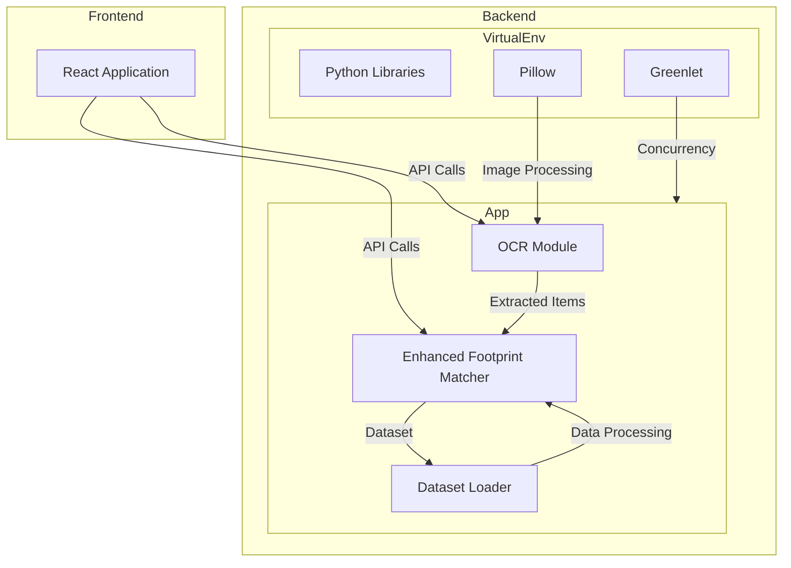

    

    <b>Automatic Architecture Diagrams from Code</b> 
    <a href="https://github.com/swark-io/swark">GitHub</a> • <a href="https://swark.io">Website</a> • <a href="mailto:contact@swark.io">Contact Us</a>

## Usage Instructions

1. **Render the Diagram**: Use the links below to open it in Mermaid Live Editor, or install the [Mermaid Support](https://marketplace.visualstudio.com/items?itemName=bierner.markdown-mermaid) extension.
2. **Recommended Model**: If available for you, use `claude-3.5-sonnet` [language model](vscode://settings/swark.languageModel). It can process more files and generates better diagrams.
3. **Iterate for Best Results**: Language models are non-deterministic. Generate the diagram multiple times and choose the best result.

## Generated Content
**Model**: GPT-4o - [Change Model](vscode://settings/swark.languageModel)  
**Mermaid Live Editor**: [View](https://mermaid.live/view#pako:eNp1ks9uwjAMxl8lyhleoIdJ9B9CAq1i0y4tB5N4bbQ0qVJnG6K8-0rLYK003_L97PiLnTMXViIPeGFKB03FXuPCsD5afxyF1FlDaOQoX2OV7xEEsVXTaCWAlDWHkQ5ps_oQxMek_E76-od6jTB_jvZsZ6XXeJiiKE9MBUagZKm11DhliO2ARIVulhrnMRC0SGxrQU7wH38TJ2_KkQedmM_pVUmenaiyhm3V0YFT2M56pXmmtLZfM3mdrx2i0Ujz5jMXK7ZcPnWrbMMi0LrtWPiPHo16OOjJN7l-Af0sNoT1g0YDvb2-Y7dNxneVZc4KbFtlyntNOtBNDSVO8M3IesCRNcI7h0acunFtfMFrdDUo2f-dc8GpwhoLHrCCS3wHr6nglz7JNxIIYwX9oGsekPO44ODJvpyM-D0768uKB--gW7z8ABgNxvE) | [Edit](https://mermaid.live/edit#pako:eNp1ks9uwjAMxl8lyhleoIdJ9B9CAq1i0y4tB5N4bbQ0qVJnG6K8-0rLYK003_L97PiLnTMXViIPeGFKB03FXuPCsD5afxyF1FlDaOQoX2OV7xEEsVXTaCWAlDWHkQ5ps_oQxMek_E76-od6jTB_jvZsZ6XXeJiiKE9MBUagZKm11DhliO2ARIVulhrnMRC0SGxrQU7wH38TJ2_KkQedmM_pVUmenaiyhm3V0YFT2M56pXmmtLZfM3mdrx2i0Ujz5jMXK7ZcPnWrbMMi0LrtWPiPHo16OOjJN7l-Af0sNoT1g0YDvb2-Y7dNxneVZc4KbFtlyntNOtBNDSVO8M3IesCRNcI7h0acunFtfMFrdDUo2f-dc8GpwhoLHrCCS3wHr6nglz7JNxIIYwX9oGsekPO44ODJvpyM-D0768uKB--gW7z8ABgNxvE)

